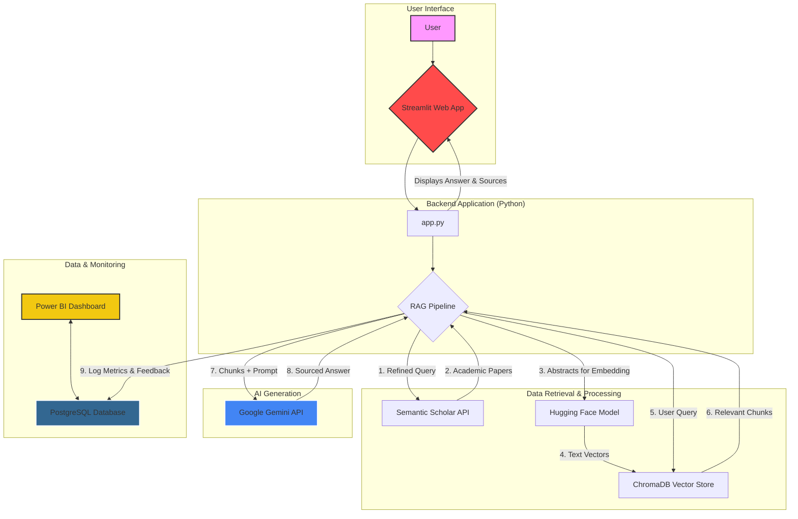

# ScholarRAG: AI-Powered Academic Research Assistant

ScholarRAG is a full-stack, production-ready AI application designed to provide trustworthy, verifiable answers to complex research questions. It addresses the critical problem of "hallucination" in Large Language Models (LLMs) by implementing a Retrieval-Augmented Generation (RAG) pipeline.

Instead of relying on its internal knowledge, the system dynamically fetches relevant academic papers, synthesizes the information, and generates a detailed answer, citing the exact sources used. This project demonstrates a complete end-to-end system, from user interface to data logging and performance monitoring.

## 🎥 Live Demo


## ✨ Key Features

*   **Retrieval-Augmented Generation (RAG):** The core of the project. Provides answers grounded in factual, verifiable academic literature, minimizing the risk of AI hallucination.
*   **Sourced Answers:** Every generated answer is accompanied by a list of the academic papers used, providing a clear audit trail and allowing for deeper research.
*   **Efficient Query Refinement:** A smart, rule-based system enhances user queries *before* searching for academic papers, leading to more relevant search results without extra API calls.
*   **Performance Monitoring Dashboard:** All interactions, including performance metrics and user feedback, are logged to a PostgreSQL database and visualized in a Power BI dashboard.
*   **User Feedback Loop:** A "thumbs up/thumbs down" system allows users to rate the quality of answers, providing crucial data for monitoring the AI's helpfulness over time.
*   **Professional Modular Architecture:** The code is cleanly separated into a user interface, a core AI pipeline, and a database connector, demonstrating best practices for maintainability and scalability.

## 🏛️ System Architecture

The application is composed of several interconnected services that work together to deliver a seamless experience.



## 🛠️ Tech Stack

A breakdown of the technologies used in this project:

| Category          | Technology / Library                                                              |
| ----------------- | --------------------------------------------------------------------------------- |
| **Frontend**      | Streamlit                                                                         |
| **Backend**       | Python 3.9+                                                                       |
| **AI & ML**       | LangChain, Google Gemini (`gemini-1.5-flash`), Hugging Face (Embeddings)            |
| **Vector DB**     | ChromaDB (with FAISS)                                                             |
| **Data Source**   | Semantic Scholar API                                                              |
| **Database**      | PostgreSQL                                                                        |
| **BI & Monitoring**| Power BI                                                                          |

## 🚀 Setup and Installation

Follow these steps to run the project locally.

### Prerequisites

*   Python 3.9+
*   PostgreSQL Server
*   pgAdmin 4 (recommended for database management)
*   Power BI Desktop (for viewing the dashboard)

### 1. Clone the Repository

```bash
git clone https://github.com/your-username/ScholarRAG.git
cd ScholarRAG
```
### 2. Set Up a Virtual Environment
code
```Bash
# Create the virtual environment
python -m venv venv
```
### Activate it
On Windows:
```
.\venv\Scripts\Activate.ps1
```
On macOS/Linux:
```
source venv/bin/activate
```
### 3. Install Dependencies
code
```Bash
pip install -r requirements.txt
```
### 4. Configure Environment Variables
* Create a file named .env in the root of the project.
* Copy the contents of the example below and paste them into your .env file.
* Replace the placeholder values with your actual API keys and database password.
---------------------------
### 4.1. API Keys 
* GOOGLE_API_KEY="PASTE_YOUR_GOOGLE_API_KEY_HERE"
* SEMANTIC_SCHOLAR_API_KEY="PASTE_YOUR_SEMANTIC_SCHOLAR_API_KEY_HERE"
------------------------------
### 4.2. Database Credentials
* DB_NAME="postgres"
* DB_USER="postgres"
* DB_PASSWORD="YOUR_POSTGRES_PASSWORD_HERE"
* DB_HOST="localhost"
* DB_PORT="5432"
---------------------------
### 5. Set Up the PostgreSQL Database
* Make sure your PostgreSQL server is running.
* Using pgAdmin or another tool, create a new database named postgres (or ensure it exists).
* The application will automatically create the rag_monitoring table on its first run.
-------------------
### 6. Launch the Application
code
```Bash
streamlit run app.py
```
----------------------------------
* The application should now be running and accessible in your web browser at http://localhost:8501.
-----------------------------------
📈 Connecting Power BI
* Open Power BI Desktop.
* Click Get Data -> PostgreSQL database.
* Enter the server (localhost) and database (postgres).
* Provide your database credentials (user: postgres, and the password from your .env file).
Select the rag_monitoring table from the navigator to load the data and build your dashboard.
